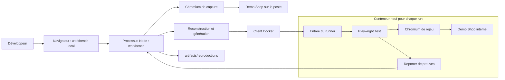
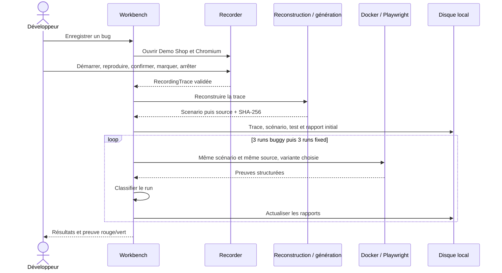
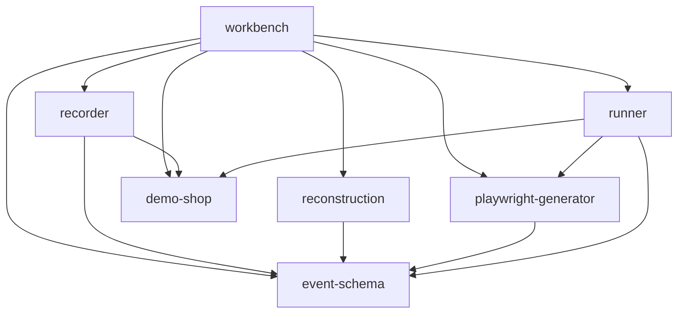

# Architecture de ReproFlow

> Référence technique du POC/MVP local livré, mise à jour le 26 septembre 2026.
> Le [brief produit](product-brief.md) décrit la vision ; ce document décrit le code
> présent dans le dépôt. Les évolutions sont suivies dans la [roadmap](roadmap.md).

> Extension du 26 septembre : un [pilote TCG Nexus](tcg-nexus-pilot.md) ajoute un
> chemin **composant** en CLI, distinct du workbench v1 décrit ci-dessous. Voir
> [ADR 0004](decisions/0004-real-component-pilot.md) et la section 19.

## Sommaire

1. [Objectif et périmètre](#1-objectif-et-périmètre)
2. [Principes structurants](#2-principes-structurants)
3. [Vue système](#3-vue-système)
4. [Organisation du dépôt et dépendances](#4-organisation-du-dépôt-et-dépendances)
5. [Capture et fixture](#5-capture-et-fixture)
6. [Contrats de données](#6-contrats-de-données)
7. [Reconstruction déterministe](#7-reconstruction-déterministe)
8. [Génération Playwright](#8-génération-playwright)
9. [Runner isolé](#9-runner-isolé)
10. [Preuves et classification](#10-preuves-et-classification)
11. [Orchestration et cycle de vie](#11-orchestration-et-cycle-de-vie)
12. [Interface et API locale](#12-interface-et-api-locale)
13. [Persistance](#13-persistance)
14. [Confidentialité et frontières de confiance](#14-confidentialité-et-frontières-de-confiance)
15. [Exploitation et diagnostic](#15-exploitation-et-diagnostic)
16. [Tests et intégration continue](#16-tests-et-intégration-continue)
17. [Limites et évolution](#17-limites-et-évolution)
18. [Décisions et guide de lecture](#18-décisions-et-guide-de-lecture)
19. [Pilote composant](#19-pilote-composant)

## 1. Objectif et périmètre

ReproFlow transforme une reproduction volontaire de bug web en test Playwright,
puis exécute ce test pour déterminer ce qui a réellement été reproduit.

La preuve centrale est une comparaison contrôlée : un seul test est généré depuis
une capture, échoue pour la raison attendue sur une application buggée, puis passe
sur sa variante corrigée. Ni les actions ni l'assertion ne changent entre les runs.

Le périmètre livré est une verticale locale nommée `demo-shop-v1` :

- une boutique synthétique avec panier, édition d'adresse et checkout ;
- un recorder Chromium avec démarrage, marqueur d'état cassé et arrêt explicites ;
- une reconstruction et une génération sans fournisseur LLM ;
- des exécutions Docker et une classification fondée sur des preuves ;
- un workbench local avec historique, import, relance, annulation et rapports.

Le projet Demo Shop est fixe. Il n'existe pas de gestion de comptes, de projets
arbitraires ni de déploiement SaaS. L'interface locale n'est pas un service destiné
à être exposé publiquement.

## 2. Principes structurants

| Principe | Traduction dans le code |
| --- | --- |
| Générer ne signifie pas reproduire | Le statut métier dépend du résultat du runner et des preuves |
| L'oracle est explicite | Seul `/checkout` confirmé est accepté par le scénario |
| L'observation reste distincte de l'attendu | `Scenario.observed` et `Scenario.oracle` sont séparés |
| Un test rouge peut échouer pour la mauvaise raison | Échecs de rejeu, d'oracle et d'infrastructure sont distingués |
| Les règles déterministes restent déterministes | Masquage, reconstruction, génération et classification n'appellent pas de LLM |
| Les données de page sont non fiables | Allowlists et validations Zod sont appliquées aux frontières |
| Le contexte navigateur ne suffit pas à isoler du code | Le test généré s'exécute dans un conteneur séparé |
| La preuve doit rester inspectable | Étapes sources, observations, résultats par run et hash du test sont conservés |
| Ajouter l'infrastructure au besoin | Fichiers locaux et orchestration en mémoire suffisent à ce POC |

Le SHA-256 identifie le contenu du test. Il permet de contrôler son identité entre
les exécutions ; il ne constitue pas une signature des résultats ou une attestation
indépendante de l'environnement.

## 3. Vue système

### 3.1 Contexte d'exécution



Le navigateur qui affiche le workbench, le Chromium de capture et le Chromium de
rejeu ont des rôles distincts. La capture s'effectue sur le poste, contre la
boutique démarrée par ReproFlow. Le rejeu démarre une nouvelle boutique dans
chaque conteneur et ne réutilise aucun état navigateur de la capture.

Le serveur du workbench et les boutiques écoutent sur `127.0.0.1`, sur des ports
libres. Dans le conteneur, le loopback interne suffit à relier Chromium à la
fixture ; aucun port n'est publié sur le poste.

### 3.2 Parcours de référence



La démo automatique pilote les mêmes contrôles dans Chromium headless. Elle
confirme l'oracle spécifié pour la fixture synthétique ; cette confirmation est
automatisée par le scénario d'acceptation, pas déduite d'une session inconnue.

## 4. Organisation du dépôt et dépendances

### 4.1 Workspaces

| Emplacement | Responsabilité | Point d'entrée utile |
| --- | --- | --- |
| `examples/demo-shop` | Serveur HTTP et assets de la fixture buggée/corrigée | [server.ts](../examples/demo-shop/src/server.ts) |
| `apps/recorder` | Injection, capture, masquage, session et export seul | [recorder.ts](../apps/recorder/src/recorder.ts) |
| `packages/event-schema` | Validation runtime et types partagés | [index.ts](../packages/event-schema/src/index.ts) |
| `packages/reconstruction` | Trace vers scénario rejouable | [index.ts](../packages/reconstruction/src/index.ts) |
| `packages/playwright-generator` | Scénario vers source ESM et hash | [index.ts](../packages/playwright-generator/src/index.ts) |
| `workers/runner` | Lancement Docker, reporter et classification | [index.ts](../workers/runner/src/index.ts) |
| `apps/workbench` | Interface HTTP, CLI, orchestration et persistance | [pipeline.ts](../apps/workbench/src/pipeline.ts) |

### 4.2 Sens des dépendances



`event-schema` est la base commune. La reconstruction dépend uniquement de ce
contrat métier. Le générateur ajoute le calcul de hash via Node. Le runner dépend
du générateur pour vérifier que la source reçue est canonique.

Le recorder et la fixture sont réutilisés via leurs exports de workspace.
L'extraction d'un `recorder-core` supplémentaire n'est pas nécessaire aujourd'hui.
Le dossier `workers` exprime une responsabilité d'exécution ; il n'existe pas
de worker distant ou de file de jobs durable.

### 4.3 Socle technique

| Élément | Choix actuel |
| --- | --- |
| Runtime du workspace | Node 24 ou 26 ; référence Node 24 dans `.nvmrc` |
| Dépendances | pnpm 10.34.5, workspaces, `pnpm-lock.yaml` |
| Langage | TypeScript strict, modules ESM, résolution NodeNext |
| Contrats | Zod |
| Build et ordonnancement | TypeScript et Turborepo |
| Tests | Vitest et Chromium via Playwright 1.63.0 |
| Style et lint | Biome |
| Interface | HTML produit côté serveur, CSS et JavaScript intégrés |
| Serveur | API HTTP native de Node |
| Stockage | JSON et HTML sur le filesystem local |
| Isolation du rejeu | Docker, image Playwright versionnée et épinglée par digest |

Les builds produisent les fichiers `dist/` consommés par les exports de packages.
Les tâches Turbo dépendent des builds des workspaces amont. Les fixtures de tests
partagées dans `tests/` font partie des dépendances globales du cache.

## 5. Capture et fixture

### 5.1 Bug de référence

Le frontend conserve un état `addressEdited`. L'enregistrement du formulaire
d'adresse le passe à vrai. Lors du checkout, le frontend envoie cet état au serveur.

Dans le mode buggé, un checkout après enregistrement de l'adresse renvoie HTTP 500.
Le frontend conserve l'URL `/cart` et émet `ADDRESS_POSTAL_CODE_MISSING`.
Dans le mode corrigé, le même parcours reçoit HTTP 200 et atteint `/checkout`.

Le code postal `69001` rend le parcours concret, mais le déclencheur implémenté
est l'enregistrement de l'adresse. La « correction » du POC est la variante
`fixed` déjà prévue dans la fixture, pas une modification automatique du dépôt.

### 5.2 Collecte

[launchRecorder](../apps/recorder/src/recorder.ts) crée un contexte non persistant,
un viewport de 1440 × 1000 et un user-agent contrôlé. Les service workers sont
bloqués, les requêtes hors origine sont refusées et les popups sont fermées.

Le [script injecté](../apps/recorder/src/capture-script.ts) installe les contrôles
dans un Shadow DOM et observe clics, saisies, soumissions et changements d'URL
SPA. Les navigations de document, erreurs console et réponses réseau pertinentes
sont aussi observées côté Playwright.

Deux bindings relient la page au collecteur : `__reproflowEvent` pour les
événements et `__reproflowControl` pour le cycle de capture. Le collecteur vérifie
la frame principale et l'origine avant d'accepter leurs appels.

Le démarrage recharge `/cart` pour rétablir l'état initial. Les interactions avant
démarrage ne sont pas conservées. La file du script maintient l'ordre de ses appels ;
les séquences globales reflètent l'ordre de réception côté Node, sans prétendre
prouver un ordre causal entre DOM et réseau.

### 5.3 Cycle de capture

```text
ready → recording → marked → stopped
                 ↘ stopped sans marqueur : incomplete
```

Le marqueur peut être mis à jour pendant l'enregistrement. La trace exportée est
`captured` si elle possède un marqueur confirmé et n'a perdu aucun événement,
sinon `incomplete`. Fermer Chromium avant l'export renvoie une annulation.

La validation du marqueur contrôle ses bornes temporelles et sa position entre
les événements. Elle ne transforme pas une déclaration de la page en preuve du
bug : cette preuve nécessite le rejeu.

Le détail du masquage est dans [capture.md](capture.md).

## 6. Contrats de données

Les frontières utilisent des objets Zod stricts. Les propriétés inattendues
sont refusées ; la validation de forme est complétée par les règles de masquage.

### 6.1 RecordingTrace

Source : [trace.ts](../packages/event-schema/src/trace.ts).

| Champ | Rôle |
| --- | --- |
| `schemaVersion`, `policy` | Version 1, politique fermée `demo-shop-v1` |
| `recordingId` | Identifiant UUID de la capture |
| `startedAtMs`, `endedAtMs` | Intervalle Unix en millisecondes |
| `environment` | Chromium, viewport, user-agent |
| `events` | Au plus 2 000 événements, séquences contiguës, temps non décroissants |
| `droppedEvents` | Compteur des événements écartés au-delà de la limite |
| `brokenState` | Position du marqueur, URL observée, attendu confirmé |
| `status` | `captured` ou `incomplete` |

Les types d'événement sont `navigation`, `click`, `input`, `submit`,
`console-error` et `network`. Les chemins, cibles et valeurs sont des enums
spécifiques à la démo, avec `[REDACTED]` ou `unknown` lorsque nécessaire.

### 6.2 Scenario

Source : [reproduction.ts](../packages/event-schema/src/reproduction.ts).

Le scénario contient la version, l'identifiant de capture, le nom de fixture,
le viewport, les étapes, l'oracle et les observations du bug.

Chaque étape associe une `action` et ses `sourceSequences`. Les actions sont
`goto`, `expect-path`, `click`, `fill` ou `submit`. Il y a de 1 à 100 étapes.
Le viewport accepté pour le rejeu va de 320 à 3840 pixels en largeur et de 240
à 2160 pixels en hauteur.

`oracle` contient exclusivement `expectedPath: "/checkout"` et
`confirmedByUser: true`. `observed` contient la route enregistrée et deux
indicateurs : présence du code console postal et d'un POST checkout 500.

### 6.3 RunEvidence, RunResult et Report

| Contrat | Contenu |
| --- | --- |
| `RunEvidence` | Issue technique, route finale, signature console, statuts checkout, nombre d'étapes terminées, durée et version Chromium |
| `RunResult` | Index 1 à 5, variante `buggy` ou `fixed`, classification, preuves et SHA-256 |
| `Report` | UUID propre, date ISO, scénario, source du test, hash, jusqu'à 10 runs et état d'orchestration |

Les statuts HTTP sont compris entre 100 et 599 ; `null` signifie un échec réseau
sans réponse. Le tableau est borné à 100 entrées. La version Chromium est
restreinte à un format numérique, ou absente si elle n'a pas pu être collectée.

Les enums initiaux `RecordingStatusSchema` et `ReproductionStatusSchema` de
[index.ts](../packages/event-schema/src/index.ts) ne pilotent pas le workbench
actuel. Ses états opérationnels viennent de ces contrats de trace et de rapport.

## 7. Reconstruction déterministe

La fonction `reconstruct(raw)` valide la trace puis applique les règles suivantes :

1. Exiger une capture complète, un marqueur et aucun événement perdu.
2. Limiter le scénario aux événements jusqu'à `brokenState.afterSequence`.
3. Exiger que la première action soit la navigation de remise à zéro `/cart`.
4. Transformer cette navigation en `goto`, et les suivantes en `expect-path`.
5. Regrouper les saisies brutes contiguës du même champ sur la même route.
6. Refuser une valeur finale masquée, même si des préfixes masqués sont tolérés.
7. Fusionner un clic `save-address` immédiatement suivi du submit correspondant.
8. Conserver un submit sans ce clic comme action clavier indépendante.
9. Refuser les actions ou cibles hors politique et plus de 100 étapes.
10. Construire séparément les observations console/réseau et l'oracle confirmé.

Les événements console/réseau ne deviennent pas des actions, mais interrompent
un regroupement de saisies s'ils sont intercalés dans la trace brute.

Une navigation observée après un clic n'est pas remplacée par `page.goto` :
forcer la destination pourrait masquer un défaut de navigation. Le rejeu attend
que l'application atteigne elle-même cette URL.

Les erreurs métier de reconstruction sont `incomplete_capture`,
`unsupported_action`, `missing_initial_state`, `masked_input` et
`too_many_steps`. Les structures invalides sont rejetées par Zod en amont.

La fusion des saisies est adaptée à la fixture actuelle, dont chaque frappe ne
déclenche pas d'effet métier nécessaire. Elle ne garantit pas le rejeu fidèle
d'une application arbitraire avec validation ou requête sur chaque touche.

## 8. Génération Playwright

`generate(raw)` revalide le scénario et retourne `{ source, sha256 }`.
Le résultat est du JavaScript ESM utilisant `@playwright/test`.

| Action normalisée | Instruction produite |
| --- | --- |
| `goto` | `page.goto("/cart")` |
| `expect-path` | Assertion d'URL résolue depuis `baseURL` |
| `click` | `page.getByTestId(target).click()` |
| `fill` | `page.getByTestId("postal-code").fill(value)` |
| `submit` | Entrée dans le champ postal |

Chaque action est entourée d'un `test.step("replay:N", ...)`.
L'assertion finale a son étape dédiée `confirmed-oracle`. Cette séparation
permet au reporter d'identifier ce qui a échoué.

Le test installe des observateurs de console et de réseau limités à la fixture.
Un bloc `finally` joint les preuves via une attachment `reproflow-evidence`.
Il ne copie pas les messages console arbitraires.

La génération est déterministe pour un scénario donné. Les valeurs interpolées
sont issues des enums et sérialisées ; aucune instruction issue d'un texte libre
n'est évaluée. Il n'y a ni réparation automatique, ni changement d'oracle,
ni tentative d'exécution d'une proposition LLM.

Le fichier exporté peut être utilisé dans un projet Playwright configuré avec
le `baseURL` d'une fixture fraîche. Le runner intégré refuse toute source éditée
qui diffère de celle que le générateur produit pour le scénario fourni.

## 9. Runner isolé

### 9.1 Frontière hôte / conteneur

[runIsolated](../workers/runner/src/index.ts) valide le scénario, régénère la source
et vérifie son égalité exacte avec la source demandée. Il lance ensuite
`docker run` avec un nom UUID et transmet scénario, source et variante sur stdin.

L'[entrée du conteneur](../workers/runner/src/container.ts) répète la validation
et l'égalité de source. Elle écrit le test dans `/work`, démarre la boutique
interne, crée une configuration Playwright et lance le CLI Playwright dans un
processus enfant. La configuration utilise un seul worker et zéro retry.

Le [reporter](../workers/runner/src/reporter.ts) écrit `/work/evidence.json`.
L'entrée relit et valide ce document, puis émet uniquement ce JSON sur stdout.
L'hôte le valide à nouveau avant classification. Une sortie absente, malformée
ou un processus runner en erreur devient un échec d'infrastructure.

### 9.2 Limites effectives

| Ressource ou mécanisme | Configuration |
| --- | --- |
| Image | `reproflow-runner:local`, pas de pull implicite au lancement |
| Utilisateur | `pwuser`, non root |
| Réseau | `--network=none`, loopback interne seulement |
| Volumes hôte | Aucun |
| Filesystem | Lecture seule hors tmpfs |
| Privilèges | `--cap-drop=ALL`, `no-new-privileges` |
| Processus | 256 maximum, init Docker activé |
| CPU / mémoire | 2 CPU, 1 Gio |
| Mémoire partagée | 256 Mio |
| `/tmp` / `/work` | Tmpfs de 256 / 64 Mio, `nosuid` |
| Action / assertion | 2 secondes |
| Navigation | 5 secondes |
| Test / session Playwright | 20 / 25 secondes |
| Surveillance côté hôte | 45 secondes |
| Commande de nettoyage | Timeout de 5 secondes |
| Entrée / sortie JSON | 100 000 / 32 000 caractères au niveau des buffers contrôlés |

Les limites de buffers ci-dessus sont des longueurs de chaînes JavaScript ;
la limite HTTP d'import, elle, est contrôlée en octets.

Le conteneur utilise `--rm`. Une annulation, un délai dépassé ou une sortie
inexploitable déclenche une tentative de `docker rm -f` sur son nom et l'arrêt
du client Docker. Si le daemon ne répond plus ou si le processus hôte est tué
brutalement, le nettoyage ne peut pas être considéré comme garanti.

### 9.3 Construction et portée de l'isolation

Le [Dockerfile](../workers/runner/Dockerfile) part de Playwright 1.63.0 sur Ubuntu
Noble, épinglé par digest. Il installe pnpm, les dépendances du lockfile et compile
les workspaces. Le [.dockerignore](../.dockerignore) sélectionne les sources et
exclut notamment `node_modules`, `dist`, les artefacts et fichiers `.env*`.

Le build a besoin du réseau pour récupérer l'image et les dépendances. L'exécution
des tests, elle, se fait sans réseau externe.

Ce profil protège le poste pour le code canonique et la fixture synthétique
supportés. Il ne constitue pas un service multitenant pour du code arbitraire ou
des sites hostiles. La confiance dans Docker, l'image et le code du runner reste
une hypothèse du POC.

## 10. Preuves et classification

### 10.1 Collecte technique

Le reporter compte les étapes `replay:N` terminées sans erreur et mémorise le
résultat de `confirmed-oracle`. Il consulte les erreurs Playwright en mémoire
pour reconnaître certaines pannes réseau ou de navigateur, sans exporter leur
texte brut.

L'issue technique est `passed`, `oracle-failed`, `replay-failed` ou
`infrastructure-failed`. Une panne avant production d'une attachment exploitable
est traitée par l'hôte comme une erreur d'infrastructure.

### 10.2 Décision métier

La fonction [classify](../workers/runner/src/classify.ts) applique cet ordre :

| Priorité | Condition | Statut |
| --- | --- | --- |
| 1 | Issue d'infrastructure ou checkout sans réponse (`null`) | `infrastructure_failure` |
| 2 | Rejeu échoué ou nombre d'étapes terminées différent du scénario | `generation_failure` |
| 3 | Test réussi et route observée égale à l'attendu | `not_reproduced` |
| 4 | Oracle échoué et toutes les preuves compatibles ci-dessous | `reproduced` |
| 5 | Autre résultat | `inconclusive` |

Pour `reproduced`, la route du run doit correspondre à celle enregistrée et
différer de l'attendu. L'erreur console postale et le POST 500 doivent avoir été
observés dans la capture, puis retrouvés dans le run.

Cette signature est spécifique à Demo Shop. Elle n'identifie pas universellement
la cause racine d'un bug. Un code de sortie non nul ou un HTTP 500 isolé ne suffit
pas à établir le verdict.

### 10.3 Agrégation et validation rouge/vert

`summarize` retourne le total, les reproductions, les réussites et les runs
inexploitables. Des résultats `reproduced` et `not_reproduced` opposés produisent
`flaky` seulement si les runs métier partagent variante, hash et version Chromium.
Les erreurs d'infrastructure ne créent pas de flakiness à elles seules et
n'effacent pas une variabilité déjà observée entre runs métier comparables.

Le workbench résume séparément les variantes. Il affiche « Validé » seulement
pour un rapport terminé contenant des runs buggés tous reproduits, des runs
corrigés tous réussis, et le hash attendu sur chaque run.

`complete` veut donc dire « orchestration terminée », pas « preuve établie ».
Trois répétitions sont des observations, pas une garantie statistique.

## 11. Orchestration et cycle de vie

[reproduce](../apps/workbench/src/pipeline.ts) réalise la chaîne commune aux
commandes CLI et au serveur :

1. Valider la trace, reconstruire, générer une seule fois.
2. Créer un UUID de rapport et son répertoire.
3. Écrire trace normalisée, scénario, source et rapport initial `running`.
4. Exécuter séquentiellement les runs `buggy`, puis les runs `fixed`.
5. Persister les résultats après chaque run et notifier l'interface.
6. Terminer en `complete`, ou en `failed` si le workflow est interrompu.

Le nombre de runs est borné entre 1 et 5 par variante dans la fonction ; CLI et
interface utilisent 3. Le premier `infrastructure_failure` interrompt la série.
Un échec de génération ou un résultat non concluant reste visible et n'entraîne
pas de réparation implicite.

Le serveur conserve une Promise active et un AbortController. Un seul workflow
peut être lancé par instance du workbench. Il n'y a pas de verrou global entre
deux serveurs ou deux CLI utilisant le même répertoire.

L'annulation ferme le recorder ou interrompt le runner. Le schéma n'a pas d'état
`cancelled` : une reproduction interrompue est `failed`, avec un message
d'annulation dans l'interface. Une capture annulée avant production d'une trace
ne crée pas de rapport.

Au redémarrage du workbench, les rapports encore `running` sont marqués `failed`.
Ils ne sont pas repris automatiquement. Une relance lit la trace conservée et
crée un nouveau rapport ; elle peut produire un nouveau test si le générateur
a évolué depuis le rapport précédent.

## 12. Interface et API locale

[server.ts](../apps/workbench/src/server.ts) sert des pages HTML construites par
[views.ts](../apps/workbench/src/views.ts). Aucun framework frontend n'est requis.
Les pages actives se rechargent toutes les 2,5 secondes ; il n'y a ni WebSocket,
ni polling JSON des résultats.

| Méthode | Route | Fonction |
| --- | --- | --- |
| GET | `/` | Historique, lancement, import et annulation |
| GET | `/reproductions/:id` | Détail, preuves, source et relance |
| GET | `/artifacts/:id/reproduction.spec.js` | Source exportée en texte |
| GET | `/artifacts/:id/report.json` | Rapport structuré |
| GET | `/artifacts/:id/recording.json` | Trace normalisée conservée |
| POST | `/api/capture` | `{"automated": false}` pour le manuel, `true` pour la démo |
| POST | `/api/import` | Trace JSON complète |
| POST | `/api/retry/:id` | Nouvelle reproduction depuis une trace conservée |
| POST | `/api/cancel` | Annulation du workflow courant |

Les mutations acceptées répondent 202 et se poursuivent de façon asynchrone.
Un second lancement pendant un workflow renvoie 409. Les requêtes invalides
renvoient 400, les origines refusées 403, les ressources inconnues 404, les
méthodes non gérées 405 et les corps trop volumineux 413.

Le serveur vérifie le Host. Les POST exigent l'Origin exact du workbench et
`Content-Type: application/json`. Le corps lu pour les lancements/imports est
limité à 500 000 octets ; `requestTimeout` est fixé à 10 secondes.

Les réponses sont `no-store`, avec `nosniff` et une CSP restrictive sur les
ressources externes, les frames et la base URL. Les scripts et styles intégrés
restent autorisés par `unsafe-inline`. Les données affichées dans le HTML sont
échappées ; cette protection ne repose donc pas uniquement sur la CSP.

Ce protocole est un mécanisme local pour l'interface, sans authentification,
gestion de rôles ni contrat d'API publique stabilisé.

## 13. Persistance

### 13.1 Organisation

```text
artifacts/
  recordings/
    <recordingId>.json          # Commande capture seule
  reproductions/
    <reportId>/
      recording.json           # Trace, userAgent normalisé
      scenario.json            # Actions et oracle
      reproduction.spec.js     # Source canonique
      report.json              # Résultats structurés
      report.html              # Vue autonome sans serveur
```

Le `recordingId` relie le scénario à sa capture. Le `reportId` identifie une
exécution du pipeline. Plusieurs rapports peuvent donc référencer la même
capture. Les chemins d'accès HTTP sont construits depuis les rapports reconnus,
pas depuis un chemin arbitraire fourni par le navigateur.

### 13.2 Écriture et reprise

Les répertoires de reproduction sont créés avec des droits demandés `0700`,
les fichiers avec `0600`. Le rapport JSON du pipeline est écrit dans un fichier
temporaire puis renommé. Cette atomicité concerne `report.json`, pas une
transaction globale entre tous les fichiers, ni une garantie de durabilité par
`fsync`.

L'export seul du recorder utilise `wx` pour refuser un écrasement. Le pipeline
normalise le champ libre `environment.userAgent` en `ReproFlow synthetic capture`
avant persistance d'une trace importée. La version effective de Chromium lors
du rejeu reste disponible dans les preuves.

Le workbench charge les rapports validés au démarrage, ignore les fichiers
invalides et garde une copie en mémoire. Il ne surveille pas les changements
effectués ensuite par un autre processus. Un rapport créé par une CLI séparée
sera visible après redémarrage du serveur.

Il n'existe ni migration de format, ni rétention automatique, ni sauvegarde
distante. Les artefacts sont ignorés par Git et restent sous la responsabilité
de l'utilisateur local.

## 14. Confidentialité et frontières de confiance

| Frontière | Données reçues | Contrôle actuel |
| --- | --- | --- |
| DOM vers script de capture | Cibles et saisies | Test IDs connus, rejet password/sensible, valeurs synthétiques autorisées |
| Page vers collecteur Node | Bindings non fiables | Frame/origine, schéma strict, politique répétée |
| URL, console et réseau vers trace | Informations potentiellement sensibles | Routes autorisées, codes fixes, métadonnées minimales |
| Fichier importé vers pipeline | JSON externe | Trace et scénario validés, user-agent normalisé avant écriture |
| Scénario vers code | Actions déclaratives | Enums fermés, génération déterministe |
| Code vers runner | Source exécutable | Égalité canonique côté hôte et conteneur, isolation Docker |
| Runner vers rapport | Preuves JSON | Reporter expurgé, contrat validé dans le conteneur et sur l'hôte |
| Rapport vers navigateur | Données persistées | Validation de structure et échappement HTML |

Les mots de passe, cookies, tokens, headers, corps réseau, textes DOM libres et
stacks console ne font pas partie des artefacts exportés. Les logs Playwright
bruts du processus enfant ne sont pas remontés à l'hôte. Captures d'écran,
vidéos et traces Playwright sont désactivées dans le runner ; les screenshots
des tests de développement portent uniquement sur la fixture ou le rapport
synthétiques.

La capture s'exécute sur le poste et n'est pas isolée par le conteneur du runner.
Elle doit donc rester limitée à la fixture maîtrisée. Une politique de routes
et de valeurs ne rendrait pas, à elle seule, sûre la visite d'un site hostile.

Les rapports locaux ne sont pas signés. Une personne pouvant modifier le disque,
l'image ou le code peut altérer les résultats. Les contrôles du POC visent la
fidélité du pipeline et la limitation de son accès au poste ; ils ne fournissent
pas une preuve résistante à un administrateur malveillant.

## 15. Exploitation et diagnostic

### 15.1 Commandes

```sh
pnpm install --frozen-lockfile
pnpm browser:install
pnpm runner:build
pnpm dev
```

Docker doit être démarré pour le rejeu. La capture seule n'en dépend pas.
`pnpm dev` compile puis démarre le serveur sur un port libre ; cette commande
ne fournit pas de rechargement automatique du code source.

| Commande | Usage |
| --- | --- |
| `pnpm dev` | Workbench local |
| `pnpm poc` | Capture automatique et preuve complète en terminal |
| `pnpm demo` | Capture manuelle puis preuve complète |
| `pnpm capture` | Capture et export seuls |
| `pnpm capture --fixed` | Capture seule sur la variante corrigée |
| `pnpm reproduce chemin/trace.json` | Pipeline à partir d'une trace |
| `pnpm runner:build` | Reconstruction de l'image locale |

La CLI du pipeline renvoie un code non nul si le critère rouge/vert n'est pas
atteint. Une capture simplement annulée termine sans preuve.

L'image contient sa copie compilée du code. Après modification du générateur,
des contrats, du runner ou de la fixture, il faut la reconstruire. Un build
TypeScript local seul ne met pas l'image à jour.

### 15.2 Diagnostic

| Symptôme | Vérification utile |
| --- | --- |
| Chromium ne démarre pas | `pnpm browser:install`, session graphique pour le manuel |
| Infrastructure indisponible | Docker démarré, image construite, ressources disponibles |
| Source refusée ou image ancienne | Reconstruire avec `pnpm runner:build` |
| Capture non exploitable | Marqueur confirmé, aucun événement perdu, valeur synthétique finale |
| Génération échouée | Examiner les étapes terminées et les événements sources |
| Résultat non concluant | Comparer l'oracle, la route et les signatures effectivement observées |
| Rapport absent après une CLI séparée | Redémarrer le workbench pour relire le disque |
| Arrêt brutal de l'hôte | Inspecter les conteneurs `reproflow-*` restants et les rapports interrompus |

Les erreurs utilisateur restent volontairement générales pour ne pas imprimer
de contenu de page. Le POC n'a pas de journal de diagnostic détaillé et expurgé
par composant, ni de métriques centralisées.

## 16. Tests et intégration continue

| Niveau | Commande | Preuve recherchée |
| --- | --- | --- |
| Agents, lint, types, unités, build | `pnpm check` | Cohérence des contrats et modules |
| Capture Chromium réelle | `pnpm test:e2e` | Capture, export, masquage, reset et annulation |
| Runner et parcours complet | `pnpm test:pipeline` | Isolation, classification négative, même test rouge/vert, interface |

Les tests de reconstruction couvrent notamment les saisies successives,
frontières d'état, submits clavier, cibles ambiguës et valeurs masquées.
Ceux du générateur vérifient déterminisme et refus de données exécutables ou
d'un oracle modifié.

Les tests Docker exercent réellement le refus d'écriture, l'absence d'accès
réseau externe et le nettoyage après annulation. Ils vérifient aussi qu'un
élément introuvable ou une assertion sans signature compatible ne devient pas
un faux « bug reproduit ».

Le [test d'acceptation](../apps/workbench/e2e/pipeline.test.ts) utilise une capture
Chromium réelle, trois runs par variante, le hash de la source écrite et les
rapports relus. Il vérifie également la normalisation du user-agent importé,
l'interface à 1440 × 1000 et 390 × 844, le téléchargement, la relance,
l'annulation et l'import invalide.

La [CI](../.github/workflows/ci.yml) configure Ubuntu avec Node 24.14.0 et 26.10.0.
Chaque job installe le lockfile, lance les contrôles, installe Chromium avec
ses dépendances système, teste la capture, construit l'image et teste le pipeline.
Le runtime dans l'image suit l'image Playwright épinglée ; la matrice Node concerne
le workspace hôte. Un résultat local vert ne prouve pas que le job distant a fini.

## 17. Limites et évolution

### 17.1 Limites assumées du POC

- Une seule application synthétique, un oracle d'URL et un navigateur.
- Pas de login, données métier persistantes ou préconditions serveur complexes.
- Pas de sélecteurs sémantiques génériques, iframes ou parcours multi-onglets.
- Pas de distinction fiable entre navigation manuelle et navigation applicative.
- Pas de conservation des effets intermédiaires de chaque frappe.
- Pas de capture vidéo, DOM snapshot ou trace Playwright utilisateur.
- Pas de fournisseur LLM, réparation automatique ou code arbitraire dans le runner.
- Historique local chargé en mémoire, sans pagination ni coordination multiprocessus.
- Pas de reprise de job, d'authentification, de stockage distant ou d'intégration GitHub.
- Verdict spécifique à la signature Demo Shop, sans promesse de généralisation.

### 17.2 Trajectoire proposée, non implémentée

Le premier pilote hors Demo Shop utilise désormais un composant réel de TCG Nexus
avec un parent synthétique (section 19), puis son parcours Next.js/API complet
dans un environnement jetable (section 20). La prochaine étape est la capture
manuelle configurable. Les abstractions restent fondées sur des cas observables.

| Besoin futur | Travail architectural préalable |
| --- | --- |
| Autres applications | Politique de capture versionnée, fixtures déclarées, nouveaux tests de confidentialité |
| Sélecteurs génériques | Métadonnées test ID/rôle/label, détection d'ambiguïté et validation au rejeu |
| Oracles plus riches | Contrat distinguant attendu confirmé, observation et hypothèse |
| Aide LLM | Interface fournisseur, sorties structurées, tentatives bornées et oracle protégé |
| Code édité dans le runner | Revue du modèle de menace et durcissement adaptés au code arbitraire |
| Projets multiples ou équipe | Identités, authentification, persistance transactionnelle et isolation des données |
| Jobs distants | États durables, file d'attente, reprise, quotas et nettoyage contrôlé |
| Intégrations | Export fondé sur les preuves, permissions et politiques de diffusion |

Next.js et PostgreSQL sont utilisés par l'application cible du pilote, pas par
le service ReproFlow. Redis/BullMQ et S3 restent des options du brief, non déployées.

## 18. Décisions et guide de lecture

Les décisions structurantes sont conservées séparément :

- [0001 — Socle du dépôt](decisions/0001-repository-foundation.md).
- [0002 — Verticale de capture locale](decisions/0002-local-capture-vertical.md).
- [0003 — Pipeline local et runner Docker](decisions/0003-local-proof-pipeline.md).
- [0004 — Pilote composant réel](decisions/0004-real-component-pilot.md).
- [0005 — Application cible jetable](decisions/0005-disposable-application-pilot.md).

Pour suivre le parcours dans le code, commencer par
[pipeline.ts](../apps/workbench/src/pipeline.ts), puis les
[contrats](../packages/event-schema/src/reproduction.ts), la
[reconstruction](../packages/reconstruction/src/index.ts), le
[générateur](../packages/playwright-generator/src/index.ts), le
[runner](../workers/runner/src/index.ts) et la
[classification](../workers/runner/src/classify.ts).
Le test d'acceptation relie ces frontières en une preuve exécutable.

Toute évolution du contrat de capture, de l'oracle, de la politique de données
ou de l'isolation doit mettre à jour ce document, la roadmap et les tests de
preuve concernés. Une capacité future ne doit pas être présentée comme livrée.

## 19. Pilote composant

Le chemin `pnpm pilot:tcg` n'est pas une migration du workbench v1. Il relie des
modules dédiés, sans élargir silencieusement les anciens enums Demo Shop :

| Frontière | Implémentation et responsabilité |
| --- | --- |
| Adaptateur TCG | `scripts/pilots/tcg-nexus.mjs` compile le vrai composant et un parent React synthétique ; seul l'adaptateur connaît le chemin TCG |
| Contrat | `packages/event-schema/src/element.ts` définit `ElementScenario`, politique numérique, locators déclarés, oracle confirmé et preuves |
| Capture scriptée | `apps/recorder/src/element.ts` exécute les actions et lit la valeur rendue, filtrée avant retour ; aucune prétention de recorder manuel |
| Génération | `packages/playwright-generator/src/element.ts` génère un unique test avec `toHaveValue` ; les chaînes de configuration sont encodées en JSON |
| Fixture | `workers/runner/src/component-fixture.ts` sert un bundle autonome limité à 4 Mo, sans lecture de fichier hôte |
| Isolation commune | `workers/runner/src/isolation.ts` conserve les mêmes limites Docker, durée, sortie et annulation pour les deux pipelines |
| Exécution | `element.ts`, `container.ts`, `reporter.ts` vérifient la source canonique et renvoient uniquement des preuves structurées |
| Verdict | `element-classify.ts` exige actions terminées, cible unique de type numérique et même écart observé que lors de la capture |

Le contrat v2 contient des actions `click`/`fill` ordonnées, des cibles identifiées
par clés, un viewport et un oracle de valeur. Les locators supportent test ID,
rôle/nom, label et placeholder exact. Les valeurs sont des nombres synthétiques
bornés ou la chaîne vide, avec une allowlist par cible. Les mots de passe et les
champs d'autres types sont rejetés. Les métadonnées DOM ne sont pas collectées.

Un échec d'oracle n'est `reproduced` que si sa valeur correspond à l'observation
capturée et diffère de l'attendu confirmé. Cible manquante, ambiguë ou incompatible :
`generation_failure`. Erreur JavaScript ou runner indisponible :
`infrastructure_failure`. Valeur masquée ou écart différent : `inconclusive`.
Le passage de l'assertion avec la valeur attendue donne `not_reproduced`.

L'entrée du conteneur accepte au maximum 8 Mo de JSON encodé pour ce mode ; le
bundle décodé est limité à 4 Mo. La limite de 100 000 caractères reste appliquée
aux requêtes Demo Shop. Le bundle est reçu par stdin et servi depuis la mémoire.
Il n'y a aucun montage du checkout TCG, port publié ni accès réseau externe.

Les artefacts `artifacts/pilots/<uuid>/` ne sont pas chargés par l'historique du
workbench. Ils incluent le hash du test, celui de chaque bundle et des entrées du
build. Le pilote vérifie que seul le composant varie entre les builds et conserve
la version du navigateur par run. Une référence Git du composant ne vaut pas
reconstruction historique de l'application entière. Voir le
[guide opératoire](tcg-nexus-pilot.md) pour le détail des preuves et limites.

## 20. Pilote application complète

`scripts/pilots/tcg-stack/build.mjs` archive un checkout TCG propre et committé,
après exclusion des fichiers dotenv et des sorties de build. Il construit la
véritable API Nest et deux builds Next standalone : seul `MarketplaceSearch`
varie, le reste vient du même commit courant. Aucun fichier du dépôt cible n'est
modifié. L'installation des dépendances et le build nécessitent le réseau ;
l'exécution des scénarios n'y a jamais accès.

L'image locale contient le moteur ReproFlow, les deux applications, PostgreSQL
16 et pgvector. `stack.cjs`, adaptateur fixe dans l'image, crée une base vierge,
initialise le schéma via TypeORM, insère une carte synthétique avec traductions,
puis démarre API et Next sur loopback. Une passerelle de même origine expose
ces services au navigateur, uniquement à l'intérieur du conteneur. Aucun port
n'est publié, aucun volume hôte ni fichier d'environnement n'est monté.

Le contrat v2 distingue `application-value` de `component-value`. Sa configuration
ajoute chemin d'entrée, cible accessible de disponibilité, chemin de réponse API
et paramètre de navigation attendu. Capture et test exigent une réponse initiale
200, la carte visible, une réponse filtrée 200 et l'URL attendue après saisie.
Sans ces préconditions, le runner renvoie `infrastructure_failure`, jamais une
reproduction. L'oracle reste uniquement la valeur numérique confirmée du champ.
Les corps réseau et les logs des services ne deviennent pas des preuves exportées.

`workers/runner/src/application.ts` utilise l'isolation commune avec un profil
dédié : image épinglée par ID SHA-256, 2 CPU, 2 Go de mémoire, 512 processus,
512 Mo de tmpfs `/work` et 120 secondes maximum par capture ou rejeu. Les autres
protections restent identiques : utilisateur non root, filesystem readonly,
capabilities supprimées, aucun réseau externe, annulation et suppression Docker.
Les données et logs temporaires disparaissent avec chaque conteneur.

La CLI `pnpm pilot:tcg:stack` capture une fois, génère une seule source et effectue
trois runs par variante, chacun sur une base neuve. Les artefacts locaux sous
`artifacts/application-pilots/` conservent provenance Git, hashes de l'archive et
du composant, identité de l'image, hash du test, version Chromium et preuves
structurées. Le [guide](tcg-nexus-stack-pilot.md) décrit les commandes et limites.
Ce flux reste scripté et séparé du workbench ; il ne constitue pas encore un
recorder manuel configurable ni un service multi-projets.
